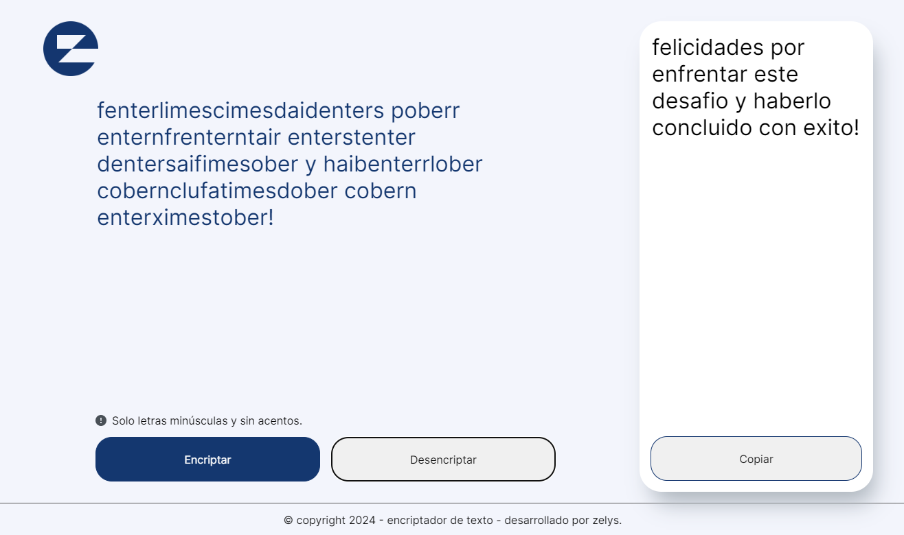

# Encriptador

## Desarrollo de la estructura

La estructura HTML de la página principal de este proyecto, está dividida en 2 secciones.

La primera sección incluye el campo que recibe el texto del usuario, a travéz de un cuadro de texto.

Dentro de la sección estará el texto de aviso con la condición que debe cumplir el texto que ingrese el usuario al encriptador. La parte inferior tendrá los botones 'Encriptar' y 'Desencriptar'.

La segunda sección incluirá el cuadro con el resultado de la encriptación, en el cual habrá una imagen y el texto informativo. Esta sección también incluye el resultado del texto encriptado o desencriptado y un botón para copiar el texto en el portapapeles.

Finalmente la estructura termina con él píe de página y la información del desarrollador.

## Captura del proyecto

[enlace web](https://zelys.github.io/encriptador-de-texto)